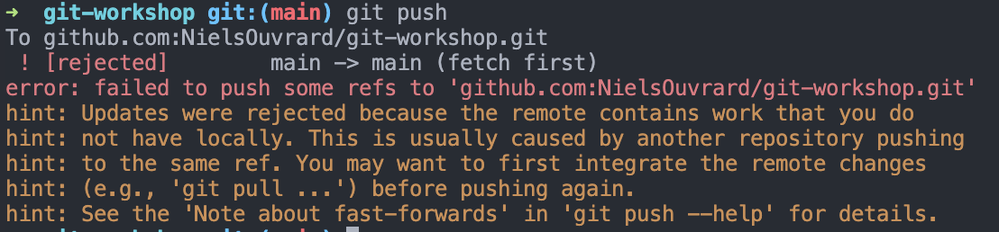
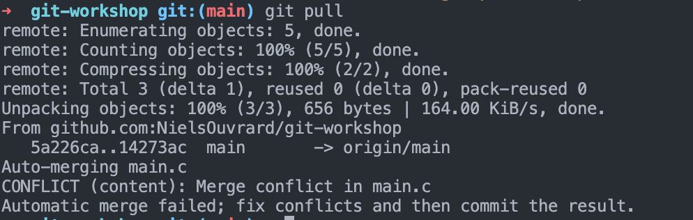
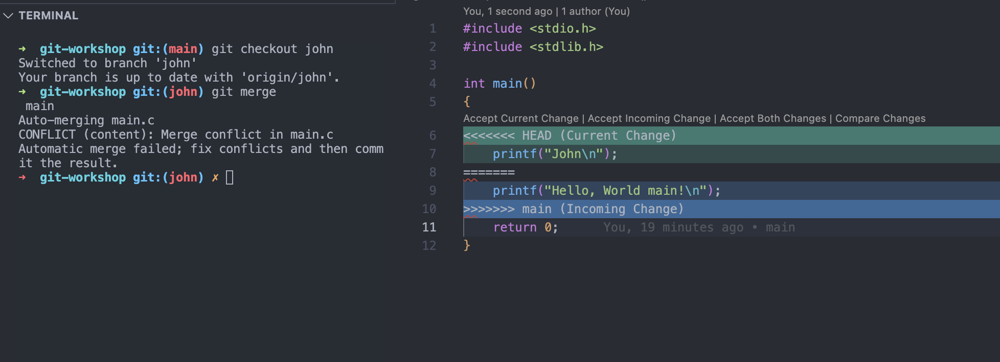
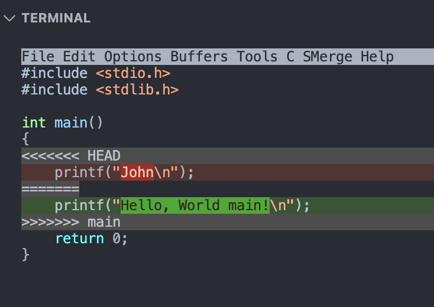
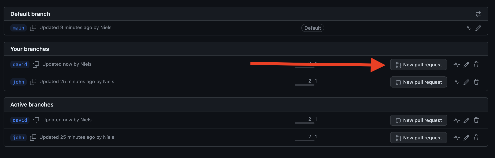
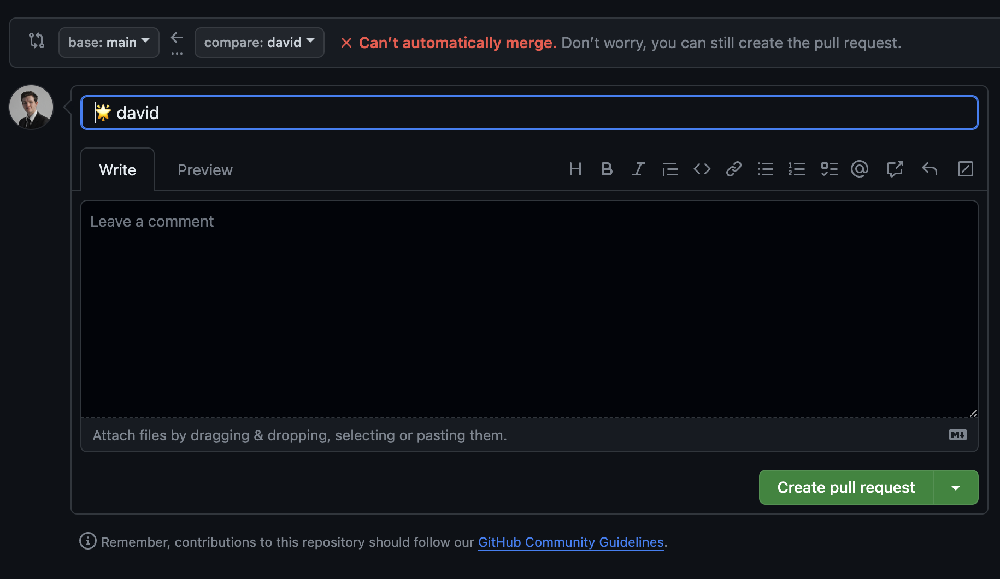
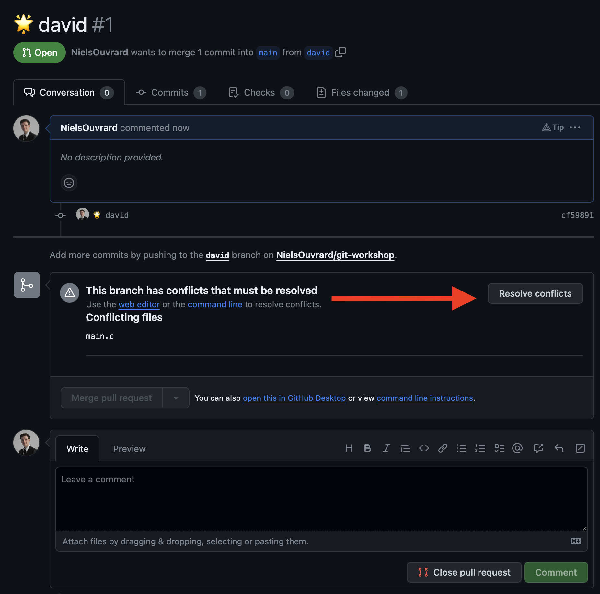
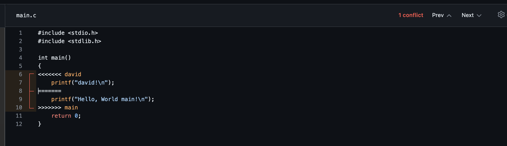

# Git and GitHub Workshop

## Workshop Overview
Welcome to the Git and GitHub Workshop my dear students ! In this workshop, you will deepen your understanding of Git and GitHub, focusing on collaboration, branching, and best practices. By the end of this workshop, you'll be well-equipped to work effectively with Git and GitHub for both personal and team projects.

## Why making branches ?

Branching make easier to work on a project with multiple people. Each person can work on a feature branch and merge their changes into the main branch when they're done. Branching also makes it easier to work on multiple features at the same time without affecting each other.

Example of issues you can have **without branches** :



Ho no ! I can't push my changes because someone else pushed changes to the remote repository. I need to pull their changes.



Ho no ! I my pull generated conflicts. I need to resolve them.

If you have this kind of issues, refer to the chapter 2.4. **Merge Branches**.
Your conflictual files will look like this (chapter 2.4).

We will see how to avoid this kind of issues with `branches`.

## Chapter 1: Creating and Cloning Repositories

Do this workshop by groups of 2 or 3. You will need to create a repository on GitHub and clone it to your local machine. Then, you will make changes to the repository and push them to the remote repository.

1.1. **Create a New Repository**
   - (**Only one in the group**) Create a new Git repository on GitHub. Go to your GitHub page and click the "New" button, in green, on the left side of the page.
   - Give it a name like "git-workshop".

1.2. **Clone a Repository**
   - Clone this repository from GitHub to your local machine.

1.3. **Make Changes and Push to GitHub**
   - (**Only one in the group**) Code something, commit your changes, and push them to the remote repository. Like a main.c file with a hello world.

# Branching and Merging

A branch will be useful for adding new features to your project without affecting the main branch. You can create a new branch for each feature you want to add to your project. Once you're done with a feature, you can merge the changes from your feature branch into the main branch.

## Chapter 2: Branching and Merging
2.1. **Create a New Branch**
   - Create a new branch with `git checkout -b <branch-name>`. The `-b` flag creates a new branch. You can call it by your name, like `git checkout -b <your-name>`.

#### Now every person of the group have a branch with their name. So you can work on your own branch and push your changes to your branch. You can also merge your branch with the main branch.


2.2. **Make Changes in a Branch**
   - Make changes to files in your branch. You can create new files, edit existing files, or delete files. For this example, edit the main.c file and modify the hello world to print your name.
   - Add, commit, and push your changes.


Now you have many branches, you can merge them with the main branch.

2.3. **Modify the main** (**Only one in the group**)
   - Move to the main branch. `git checkout main`
   - Modify the main.c file in the main branch. Change the hello world to print "Hello, world from main!".
   - Return to your branch. `git checkout <your-name>`

2.4. **Merge Branches**
   - Merge changes from main to your branch. `git merge main`
   - You'll see some conflict markers in the files that were modified in both branches. Open the files and resolve the merge conflicts.

#### on vscode



#### on emacs



2.5. **Resolve Merge Conflicts**
   - `HEAD` is the most recent commit on your current branch. The other commit is the most recent commit on the branch you're merging from.
   - `main` is the branch you're merging from.
   - Remove the comments `<<<<<<< HEAD` and `>>>>>>> main` and keep the code you want to keep.
   - Add, commit, and push your changes.

## Chapter 3: Collaborating on GitHub
3.1. **Create a Pull Request**
   - Make changes in your repository is an easy way to merge changes from one branch to another.
   - Discuss and review code changes with others.

#### go to branches on github


#### create a pull request




#### give a title



#### resolve conflicts



#### resolve conflicts and merge



3.2. **Review and Merge Pull Requests**
   - Merge changes into the original repository.

## Chapter 4: Best Practices and Workflows
4.1. **.gitignore**
   - Create a `.gitignore` file to exclude files and directories from version control. A gitignore is a file that tells Git which files and directories to ignore in a project. An example :
```.gitignore
*.log
*~
#*
a.out
*.o
*.exe
```

4.2. **Commit Messages**
   - Write clear and descriptive commit messages. You can use emojis to make your commit messages more expressive :
```
   # some emojis
🚀 :rocket:         New release
🤖 :ci:             Changes to our CI configuration files and scripts
🎉 :tada:           Awesome new feature - let's celebrate!
📖 :docs:           Documentation only changes
🌟 :feat:           A new feature
🚑 :fix:            A bug fix
⚡️ :perf:            A code change that improves performance
♻️ :refactor:        A code change that neither fixes a bug nor adds a feature
🎨 :ui:             Changes that affect only UI/styles
✅ :test:           Adding missing tests or correcting existing tests
💩 :dirty:          Dirty code - needs to be refactored - think to add @debt in your code
🔀 :migration:      Doctrine migrations
✏️  :typo:           A typo fix
👷️ :ops:            Code for infrastructure
🚧️ :wip:            Work in progress
```

4.3. **Creating Tags**
   - Create annotated and lightweight tags to mark significant points in your project's history.

## Chapter 6: Git Stash
6.1. **Stashing Changes**
   - Staging is a way to mark files as ready to be committed. You can use `git stash` to save changes that you don't want to commit yet.

6.2. **Applying Stashed Changes**
   - Apply stashed changes to your working directory with `git stash apply`.

## Conclusion
Congratulations! You've completed the Git and GitHub Workshop. You are now equipped with the knowledge and skills to use Git and GitHub effectively in your programming projects. Remember to continue practicing and exploring advanced features to become a Git and GitHub expert.

Happy coding! 🚀
